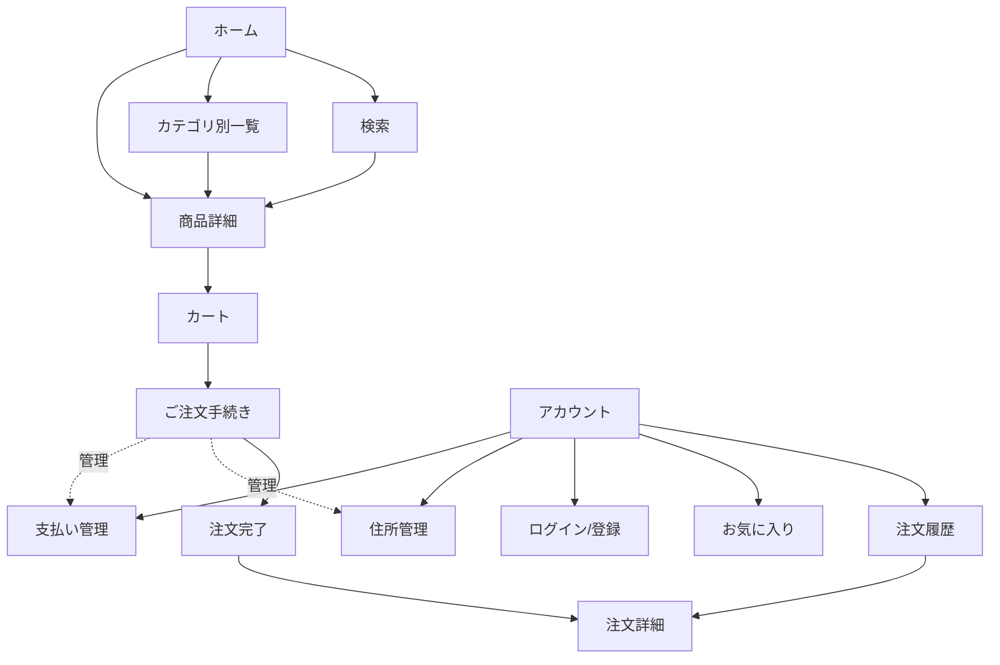
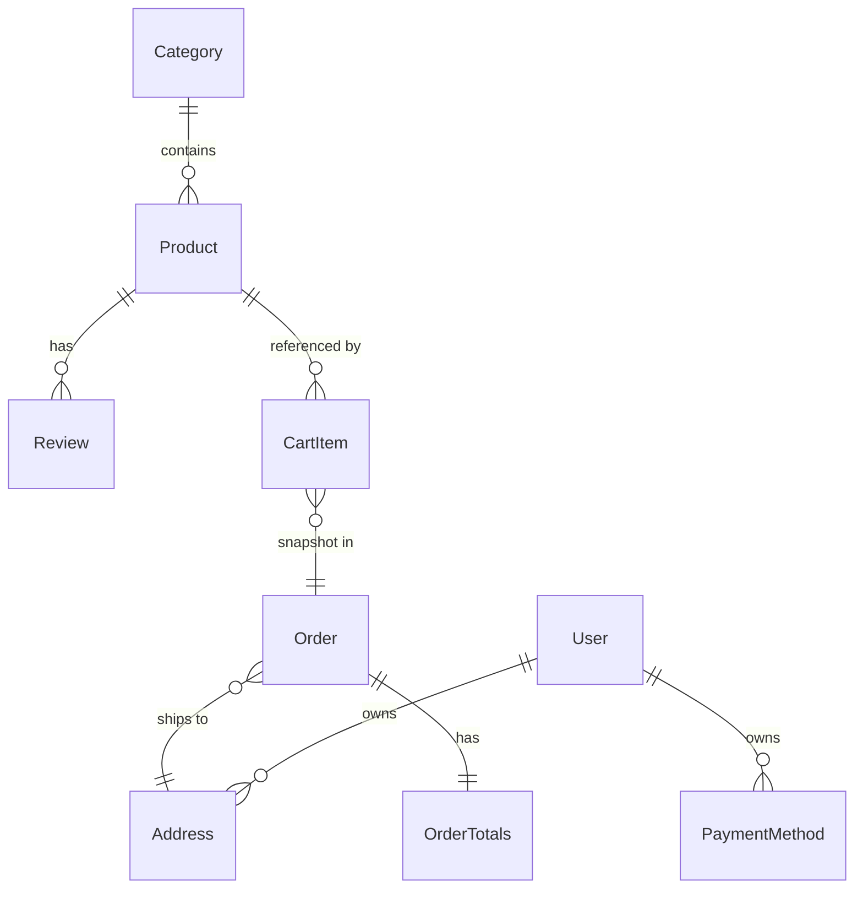

# sut-ec-mobile 概要設計書

## 0. 本書について

| 項目 | 内容 |
|---|---|
| 文書名 | sut-ec-mobile 概要設計書 |
| 対象システム | SUT Store(EC モバイルアプリ) |
| 版 | 第2段階（サーバー実装）完了（2026-07-19） |
| 位置づけ | 本システムの全体像(構成・機能・画面・データ)を俯瞰する上位設計文書 |

### 関連文書
- **実装の正本(詳細設計)**: [docs/design.md](design.md) … 技術選定・ディレクトリ構成・実装フェーズ計画の詳細。矛盾が生じた場合は用途に応じて参照（詳細な実装判断は design.md、全体俯瞰は本書）。
- **サーバー実装の正本(第2段階・現行)**: [docs/server-design.md](server-design.md) … API 契約・DB スキーマ・認証・サーバー/クライアント実装状況。**第2段階の現行動作はこちらが正**。
- **ユーザーマニュアル**: [docs/user-manual.md](user-manual.md) … エンドユーザー向けの操作説明。

### 対象読者
開発者・レビュアー・本プロジェクトに新規参加するメンバー。実装に入る前に全体構造を把握するための入口となることを目的とする。

---

## 1. システム概要

### 1.1 目的
Amazon 風の EC 買い物アプリを **Compose Multiplatform** で構築し、**iOS / Android の両方**で同一の UI・ロジックを提供する。買い物〜アカウント管理までの主要 10 機能を、画面遷移・カート操作・チェックアウトまで通しで動作させる。

### 1.2 スコープ
第1段階(モックアップ)・第2段階(サーバー実装)とも完了。範囲は以下のとおり。

| 区分 | 内容 |
|---|---|
| **第1段階(完了)** | 全 10 機能の UI・画面遷移・状態管理。データは**ローカルのインメモリ・ダミー**で完結。 |
| **第2段階(完了・[server-design.md](server-design.md))** | サーバー API 連携（Ktor3）、実認証（JWT/bcrypt）、データ永続化（PostgreSQL）、画像配信のサーバー統合。Android/iOS 実機で E2E 検証済み。 |
| **対象外(将来)** | 実決済、画像の CDN/オブジェクトストレージ配信・オフライン同梱。 |

### 1.3 前提・特性（現行＝第2段階）
- データは **PostgreSQL に永続化**（ユーザー単位）。アプリを終了しても、ログインすればアカウントの内容が復元される。
- 通信は **実 API**（Ktor サーバーの `/api/v1`）。カタログは公開、cart/wishlist/orders/account は要認証。
- 商品画像は **`:server` が `/images` で配信**。実行時にサーバー起動を要する（既定 Android=`10.0.2.2:8090` / iOS=`127.0.0.1:8090`、設定可能）。停止時は全画像がプレースホルダになる。
- 認証は **実認証**（bcrypt でハッシュ、JWT）。要アカウント登録（同一メールの二重登録・誤パスワードは失敗）。
- ※ 第1段階（モック）は、インメモリ + `delay()` 擬似 + python 画像配信(:8000) + 「任意情報でログイン成功」だった（第2段階で置換済み）。

---

## 2. システム構成

### 2.1 アーキテクチャ方式（現行 = 第2段階）
- **3モジュール構成**: `composeApp`(KMP アプリ本体。commonMain にロジック/UI を集約し androidMain / iosMain は各プラットフォームのエントリと HTTP エンジンのみ) / **`:shared`**(モデル・`Totals`・`SearchQuery`・`AppLanguage`・DTO をクライアント/サーバー間で共有) / **`:server`**(Ktor サーバー)。
- **UI(Compose) → ViewModel(StateFlow) → Repository(`Remote*`)** の単方向データフロー。`Remote*Repository` が Ktor client で `:server` の `/api/v1` を呼び、結果をローカル `StateFlow` にキャッシュして全画面へ配信する（カート/お気に入り等の変更系は楽観更新 + 背景同期）。
- 依存解決は **Koin** による DI。

```
┌──────── :server (Ktor3+Netty) ────────┐
│  routes → service/repository → Exposed → PostgreSQL │
│  /api/v1(catalog, auth, cart, wishlist, orders,      │
│          addresses, payment-methods) / 静的 /images  │
└───────────────────↑ HTTP(JSON) ──────────────────────┘
                     │
┌──────────── composeApp: commonMain ───────────────────┐
│  UI (Compose Screens)                                 │
│        ↓ 状態購読 / イベント                            │
│  ViewModel (androidx.lifecycle)                       │  ← StateFlow で UI 状態を公開
│        ↓ 呼び出し                                       │
│  Repository (interface, :shared のモデルに依存)          │
│        ↓ 実装                                          │
│  Remote*Repository (data/repository/impl)             │  ← Ktor client + StateFlow キャッシュ
│        ↓ 使用                                          │
│  ApiClient / TokenStore (data/remote)                 │
└─────────────────────────────────────────────────────────┘
   ↑ Koin(DI) が全レイヤを結線
androidMain: MainActivity / Ktor(OkHttp) / ServerConfig=10.0.2.2:8090
iosMain    : MainViewController / Ktor(Darwin) / ServerConfig=127.0.0.1:8090
iosApp     : Xcode プロジェクト(SwiftUI が ComposeUIViewController をホスト)
```

第1段階(モック)は `composeApp` 単一モジュールで、Repository はインメモリ実装 + `MockCatalog` シードだった（サーバー層なし）。第2段階で `:shared`/`:server` を新設し上記へ置換。

### 2.2 技術スタック(要点)

| 分類 | 採用 |
|---|---|
| 言語 / UI | Kotlin 2.4.x / Compose Multiplatform 1.11.0(Material 3) |
| ターゲット | Android / iOS(arm64・simulatorArm64・x64) |
| ナビゲーション | navigation-compose(型安全 `@Serializable` ルート) |
| 状態管理 | androidx.lifecycle ViewModel + kotlinx-coroutines / StateFlow |
| DI | Koin 4.x |
| 画像 | Coil 3(+ Ktor エンジン: Android=OkHttp / iOS=Darwin) |
| シリアライズ | kotlinx-serialization(ナビ引数・モデル) |
| 国際化 | 自前 `tr(ja, en)`(呼び出し側インライン) + `LocalAppLanguage`(CompositionLocal) + `LocaleController`(実行時トグル) |

> 詳細な選定理由・バージョン・ディレクトリ構成は [design.md](design.md) を参照。

---

## 3. 機能一覧

| # | 機能 | 概要 | 主担当リポジトリ |
|---|---|---|---|
| 1 | 商品一覧・カテゴリ | ホーム(おすすめ/ベストセラー/カテゴリ)とカテゴリ別一覧 | ProductRepository |
| 2 | 検索・絞り込み | キーワード / カテゴリ / 価格帯 / 並び替え | ProductRepository |
| 3 | 商品詳細 | 画像カルーセル・レビュー・関連商品・カート追加 | ProductRepository |
| 4 | カート | 数量変更・削除・小計/送料計算 | CartRepository |
| 5 | チェックアウト | 住所・支払い選択 → 注文確定 → 完了 | Cart / Account / Order |
| 6 | お気に入り | 登録/解除・一覧(全画面同期) | WishlistRepository |
| 7 | 注文履歴 | 一覧・詳細・ステータス表示 | OrderRepository |
| 8 | ログイン/サインアップ | 実認証(bcrypt/JWT。要登録・二重登録409・誤資格401) | AuthRepository |
| 9 | プロフィール/設定 | ユーザー表示・言語切替・ログアウト | Auth / Account |
| 10 | 住所・支払い管理 | 追加/編集/削除/デフォルト設定 | AccountRepository |

---

## 4. 画面設計概要

### 4.1 画面(ルート)一覧
型安全ルート（`@Serializable`）で定義。括弧内は遷移引数。

| ルート | 画面 | 引数 | タブ根 |
|---|---|---|---|
| `HomeRoute` | ホーム | – | ○ |
| `SearchRoute` | 検索 | initialQuery? | ○ |
| `CartRoute` | カート | – | ○ |
| `WishlistRoute` | お気に入り | – | ○ |
| `AccountRoute` | アカウント | – | ○ |
| `CatalogRoute` | カテゴリ別一覧 | categoryId? | |
| `ProductDetailRoute` | 商品詳細 | productId | |
| `CheckoutRoute` | ご注文手続き | – | |
| `OrderConfirmationRoute` | 注文完了 | orderId | |
| `OrdersRoute` | 注文履歴 | – | |
| `OrderDetailRoute` | 注文詳細 | orderId | |
| `LoginRoute` / `SignupRoute` | ログイン / 登録 | – | |
| `AddressesRoute` / `AddressEditRoute` | 住所一覧 / 編集 | addressId?(編集時) | |
| `PaymentMethodsRoute` / `PaymentEditRoute` | 支払い一覧 / 編集 | paymentId?(編集時) | |

- **下タブ(5)**: ホーム / 検索 / カート / お気に入り / アカウント。タブ切替は状態保存 + `launchSingleTop`。
- カートタブには**合計点数バッジ**を表示（`CartRepository.count` を購読）。
- 商品詳細・チェックアウト等の非タブ画面では下タブを隠し、TopBar の戻るで復帰。

### 4.2 主要画面遷移



### 4.3 通しシナリオ(代表)
一覧 → 検索/絞り込み → 商品詳細 → カート追加 → 数量変更 → チェックアウト → 注文確定 → 注文履歴に反映 / お気に入り登録↔一覧同期 / ログイン → 言語トグルが全画面即時反映 / 住所・支払いの CRUD。

---

## 5. データ設計概要

### 5.1 主要エンティティ
すべて `@Serializable`（`:shared` で client/server 間の API JSON にそのまま流用）。金額は**円の整数**（minor unit なし）。文言は日英を両持ちし `name(lang)` 等で解決。

| エンティティ | 主なフィールド | 備考 |
|---|---|---|
| **Product** | id, name/brand/description(ja/en), priceYen, listPriceYen?, categoryId, imageUrls[], rating, reviewCount, inStock, tags[] | `listPriceYen>priceYen` で割引率算出 |
| **Category** | id, name(ja/en), emoji | 8 カテゴリ |
| **Review** | id, productId, authorName, rating(1–5), title/body(ja/en), date | 商品に紐づく |
| **ProductTag** | PRIME / BESTSELLER / NEW / SALE / LOW_STOCK | バッジ表示 |
| **CartItem** | product, quantity | `lineTotalYen = price × qty` |
| **OrderTotals** | subtotalYen, shippingYen, taxYen | `totalYen` は合算 |
| **Order** | id, items[](スナップショット), totals, status, placedAt, shippingAddress, paymentLabel | 確定後はカート変更の影響を受けない |
| **OrderStatus** | PROCESSING / SHIPPED / DELIVERED / CANCELLED | |
| **User** | id, name, email | サーバー採番。パスワードはハッシュのみサーバー側保持(このモデルには含まれない) |
| **Address** | id, fullName, postalCode, prefecture, city, line1, line2?, phone, isDefault | |
| **PaymentMethod** | id, type, brand/last4/holderName/exp(CARD 時のみ), isDefault | |
| **PaymentType** | CARD / CASH_ON_DELIVERY | |

### 5.2 エンティティ関連(概念)



### 5.3 データ保持方針
- **第1段階(歴史)**: カタログは `MockCatalog` のシード（読み取り専用）。カート・お気に入り・認証セッション・住所/支払いは各 Repository が `StateFlow` でインメモリ保持。ID はインメモリのカウンタで採番、永続化しない。
- **第2段階(現行)**: 上記は **PostgreSQL 永続・ユーザー単位**に置換（`MockCatalog` はサーバー起動時シード `CatalogSeed` へ移植）。ID はサーバー採番。client の `Remote*Repository` はサーバーの値を `StateFlow` にキャッシュし画面横断で共有・即時同期する。詳細は [server-design.md](server-design.md) §5。

---

## 6. 主要な処理方式・業務ルール

| 項目 | 規則 |
|---|---|
| **価格表示** | すべて税込。したがって `taxYen = 0`。 |
| **送料** | 小計 **3,000 円以上で無料**、未満は **一律 500 円**。空カートは 0 円。（`Totals.kt` が唯一の算出実装で cart/checkout/order が共用） |
| **注文確定** | サーバーがカートから Order を構築し**金額を権威計算**（`computeOrderTotals`）→ items は Product スナップショット → 注文追加 → カートをクリア。初期ステータスは PROCESSING。client は住所/支払いの選択 ID のみ送る。 |
| **認証** | 実認証。bcrypt でパスワードをハッシュ保存、成功で JWT 発行。二重登録は 409、誤資格は 401。client は JWT を `TokenStore` に保持し `Authorization: Bearer` で送信。 |
| **お気に入り同期** | `WishlistRepository.productIds`(StateFlow) を全画面が購読し、どこで toggle しても即反映。 |
| **国際化(i18n)** | `LocaleController`(StateFlow) を Koin シングルトンで保持 → App が `LocalAppLanguage` に供給 → 全画面が即時再構成。文言は呼び出し側でインラインに `tr(ja, en)`。 |
| **デフォルト設定** | 住所・支払いは 1 件を既定にでき、チェックアウトで初期選択に用いる。 |

---

## 7. 外部インターフェース

| 種別 | 内容 | 備考 |
|---|---|---|
| REST API | `:server` の `/api/v1`（カタログ/認証/cart/wishlist/orders/account） | 既定 Android=`10.0.2.2:8090` / iOS=`127.0.0.1:8090`（設定可能）。**実行時にサーバー起動が必須** |
| 商品画像 | 同サーバーの `/images/<id>-<n>.jpg` 静的配信 | `imageUrls` は相対パス、クライアントが接続先 URL で解決。停止時はプレースホルダ |
| HTTP エンジン | client: Android=OkHttp / iOS=Darwin（Coil 3 + Ktor client）。server: Netty | プラットフォーム別 |

第1段階は外部 API なし（インメモリ + python 画像配信:8000）だった。第2段階で上記の実サーバーへ置換（python 画像配信は廃止）。詳細は [server-design.md](server-design.md)。

---

## 8. 非機能要件・制約

| 項目 | 内容 |
|---|---|
| **対応 OS** | Android / iOS(単一 Compose UI を共用) |
| **デザイン** | ライト & ミニマル基調(白基調・単色アクセント)。**システムのダークモードに追従**(第2段階で実装)。 |
| **国際化** | 日英 2 言語・実行時トグル。 |
| **性能** | 第2段階は実 API（ローカルは数ms〜数十ms）。実運用性能は本番デプロイ時に再評価。 |
| **保守性** | 保守者は Claude Code。1 ファイル約 2,000 行以下、1 タスクの編集は 1〜2 ファイルに収める。機能は `feature/xxx` ディレクトリ単位で疎結合。 |
| **iOS 固有制約(罠)** | 起動時に `Info.plist` の `CADisableMinimumFrameDurationOnPhone=true` が必須(無いと `PlistSanityCheck` 例外で即クラッシュ)。`iosApp/project.yml` は明示 Info.plist でこのキーを付与し、`xcodegen generate` 再実行時も維持する。 |

---

## 9. 制約・前提・未確定事項

- **永続化なし(第1段階)**: インメモリのみ。再起動で初期化。第2段階で PostgreSQL 永続化（[server-design.md](server-design.md)）。
- **実決済なし**: 支払いは選択のみで課金は発生しない（第2段階も実決済は対象外）。
- **モック認証(第1段階)**: 任意情報で成功。第2段階で bcrypt/JWT の実認証に置換（「任意情報で成功」は廃止）。
- **未確定(将来)**: 実決済連携、画像の CDN 配信・オフライン同梱切替。

---

## 10. 検証観点(概要)

- **ビルド**: Android=`./gradlew :composeApp:assembleDebug` / iOS=`xcodebuild`(simulator) / サーバー=`./gradlew :server:build`。
- **自動テスト(サーバー)**: `./gradlew :server:test` … 単体(`OrderTotalsTest`) + 実 PostgreSQL への統合テスト(`ApiIntegrationTest`、11件)。DB は Testcontainers / `TEST_DATABASE_URL` / スキップ の3モード。
- **起動**: DB=`./scripts/dev-server.sh`(Apple Container で Postgres) → サーバー=`./gradlew :server:run` → Android エミュレータ / iOS シミュレータ。
- **通しシナリオ**: [4.3](#43-通しシナリオ代表) を両 OS で確認（実サーバー接続下）。
- **レビュー観点**: 差し色の使い方・余白・言語切替漏れ・状態同期(カート/お気に入りバッジ)。

> 現状（第2段階完了）: 全 10 機能を実装し、**実サーバー（Ktor3 + PostgreSQL + JWT）接続下**で Android エミュレータ / iOS シミュレータの双方で動作確認済み。サーバー API は Apple Container の Postgres で E2E 検証済み（詳細は [server-design.md](server-design.md) §11.5）。
