# SUT Store ユーザーマニュアル

SUT Store は、スマートフォンで買い物ができる EC(ネットショッピング)アプリです。商品を探す・カートに入れる・注文する、といった一連の操作を iOS / Android の両方で行えます。本マニュアルでは、各画面の使い方を順を追って説明します(掲載している画面例は Android 版のものです。iOS 版も画面構成は同じです)。

> **このアプリについて（デモ版のご案内）**
> 現在のバージョンは動作を体験していただくための**デモ版**です。実際のサーバーと連携して動作します。以下の点にご注意ください。
> - 注文しても**実際の商品は発送されず、料金も請求されません**（決済・配送は行われません）。
> - ログインは**実際のアカウント登録が必要**です。初回は「アカウントを作成」でメールアドレスとパスワードを登録し、次回以降は同じ情報でログインします（同じメールアドレスの二重登録や、誤ったパスワードでのログインはできません）。
> - **ログインすると**、カート・お気に入り・注文履歴・住所・お支払い方法は**アカウントに保存され**、アプリを終了しても保持されます。ログイン前のカートは一時的なもので、ログイン時にアカウントの内容へ切り替わります。
> - 新しいアカウントは**空の状態**から始まります（サンプルの住所・注文は入っていません）。初回のご注文手続きで住所とお支払い方法を登録してください。
> - 商品情報・画像は **SUT Store サーバーから取得**します。アプリ利用にはサーバーへの接続が必要です（サーバーが停止していると商品が表示されません）。
> - 一度ログインすると、**アプリを終了して再度開いてもログインしたまま**です。ただし時間が経つとセッションが切れ、その際は「セッションが切れました。再度ログインしてください」と表示されてログアウトされます。その場合は再度ログインしてください。
> - 端末を**ダークモード**にしていると、アプリの画面も自動的に暗い配色に切り替わります（アプリ内に切り替え設定はありません）。
> - 通信状況などにより商品や注文履歴の読み込みに失敗すると、「読み込みに失敗しました」と表示されます。「再試行」ボタンでやり直せます。ご注文の確定に失敗した場合も、その旨のメッセージが表示されます。

---

## 目次

1. [画面の全体構成（下部タブ）](#1-画面の全体構成下部タブ)
2. [ホーム](#2-ホーム)
3. [商品を探す（検索・絞り込み）](#3-商品を探す検索絞り込み)
4. [商品詳細を見る](#4-商品詳細を見る)
5. [カート](#5-カート)
6. [ご注文手続き（チェックアウト）](#6-ご注文手続きチェックアウト)
7. [注文履歴](#7-注文履歴)
8. [お気に入り](#8-お気に入り)
9. [アカウント](#9-アカウント)
10. [お届け先住所の管理](#10-お届け先住所の管理)
11. [お支払い方法の管理](#11-お支払い方法の管理)
12. [表示言語の切り替え（日本語 / English）](#12-表示言語の切り替え日本語--english)
13. [よくある質問・用語集](#13-よくある質問用語集)

---

## 1. 画面の全体構成（下部タブ）

画面の下端には、常に **5つのタブ** が表示されます。タップするといつでもその画面に移動できます。

| アイコン | タブ名 | できること |
|---|---|---|
| 🏠 | **ホーム** | おすすめ商品・カテゴリの一覧を見る |
| 🔍 | **検索** | キーワードや条件で商品を探す |
| 🛒 | **カート** | 買い物カゴの中身を確認・変更する |
| ♡ | **お気に入り** | 気になる商品を保存して後で見る |
| 👤 | **アカウント** | ログイン・注文履歴・各種設定 |

- **カートタブのバッジ**：カートに商品を入れると、カートアイコンに数字(合計点数)が表示されます。どの画面にいても即座に反映されます。
- 商品詳細やチェックアウトなど、一部の画面では下部タブが隠れ、左上の「←(戻る)」で前の画面に戻ります。

---

## 2. ホーム

アプリを開くと最初に表示される画面です。上から順に、以下が並んでいます。

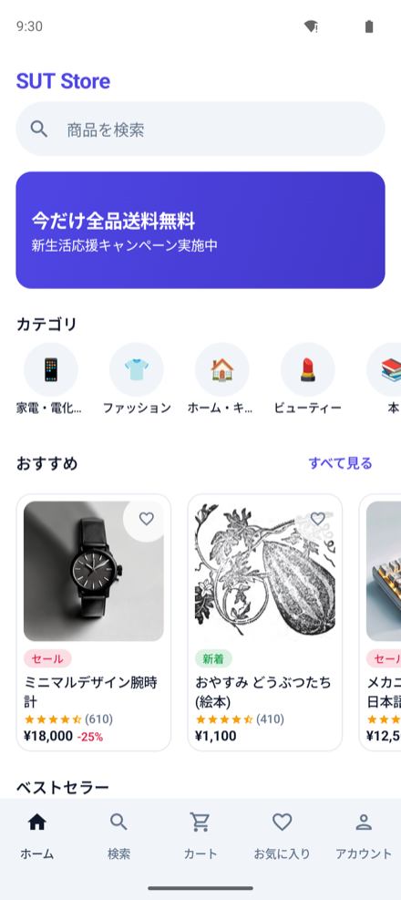

1. **検索バー**（「商品を検索」）：タップすると検索画面が開きます。
2. **キャンペーンバナー**：現在実施中のお得情報が表示されます。
3. **カテゴリ**：「家電・電化製品」「ファッション」「ホーム・キッチン」など、8つのカテゴリが横並びで表示されます。タップするとそのカテゴリの商品一覧に移動します。
4. **おすすめ**：ピックアップ商品が横スクロールで並びます。「すべて見る」で一覧へ。
5. **ベストセラー**：人気商品が横スクロールで並びます。

商品カードでは、右上の **♡(ハート)** をタップするとその場でお気に入りに登録／解除できます。カード本体をタップすると商品詳細へ進みます。

---

## 3. 商品を探す（検索・絞り込み）

下部タブの **検索** 、またはホームの検索バーから開きます。

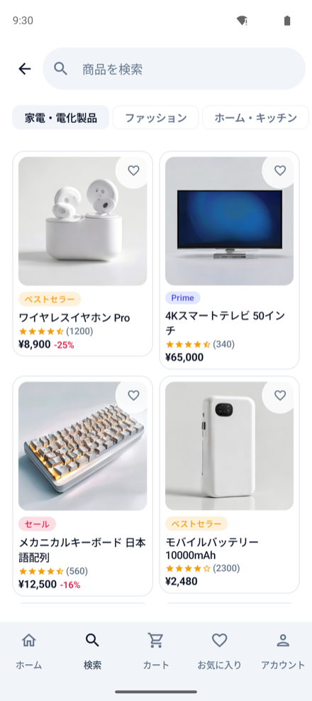

### キーワードで探す
上部の入力欄に商品名やブランド名などを入力して検索します。

### 条件で絞り込む・並び替える
検索画面では、次の条件を組み合わせて商品を絞り込めます。条件を選ぶと自動で結果が更新されます。

- **カテゴリ**：8カテゴリから1つを選択。
- **価格帯**：以下のいずれかを選択できます。
  - 〜1,000円
  - 1,000〜5,000円
  - 5,000〜20,000円
  - 20,000円〜
- **並び替え**：
  - おすすめ順
  - 価格の安い順
  - 価格の高い順
  - 評価の高い順
  - 新着順

条件に一致する商品がない場合は、その旨が表示されます。各商品カードからは、詳細を開く・お気に入り登録などが行えます。

---

## 4. 商品詳細を見る

商品カードをタップすると、その商品の詳細画面が開きます。

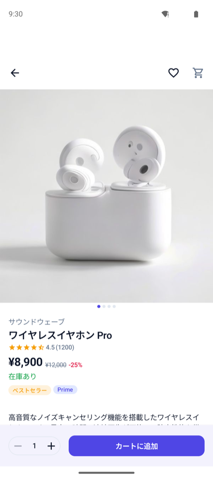

### 表示される情報
- **画像カルーセル**：商品画像を左右にスワイプして切り替えられます(画像下のドットが現在の位置を示します)。
- **ブランド名・商品名**
- **評価**：星の数と、レビュー件数。
- **価格**：セール中の商品は、割引後の価格と元の価格(取り消し線)が並びます。
- **在庫状況**：「在庫あり」または「在庫切れ」。
- **タグ**：商品に応じて「ベストセラー」「Prime」「セール」「新着」「残りわずか」などが付きます([用語集](#タグの意味)を参照)。
- **商品説明**
- **レビュー**：購入者の評価・コメント・投稿日。
- **関連商品**：似た商品が横スクロールで表示されます。

### 操作
- **右上の ♡**：お気に入りに登録／解除します。
- **右上の 🛒**：カート画面へ移動します。
- **画面下部**：
  - **数量ステッパー（− / ＋）**：カートに入れる個数を調整します。
  - **「カートに追加」ボタン**：現在の数量でカートに入れます。追加すると画面下に「カートに追加しました」と表示され、「見る」でカートへ移動できます。在庫切れの商品では押せません。

---

## 5. カート

下部タブの **カート**、または商品詳細の 🛒 から開きます。

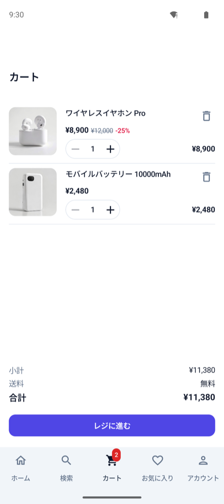

### カートに商品があるとき
- 各商品について、**画像・商品名・価格・数量・小計**が表示されます。
- **数量の変更**：各商品の **− / ＋** で個数を増減できます。数量を 1 から更に減らす(0にする)と、その商品はカートから削除されます。
- **削除**：各商品右上の **ゴミ箱アイコン** で削除できます。
- **送料無料まであといくら**：小計が送料無料の基準に届いていない場合、「あと◯◯円で送料無料」と案内が表示されます。
- **画面下の合計欄**：
  - 小計
  - 送料（基準額以上で「無料」）
  - 合計
- **「レジに進む」ボタン**：チェックアウト(ご注文手続き)へ進みます。

> **送料について**：商品の小計が **3,000円以上** で送料無料。3,000円未満の場合は **送料500円** がかかります。価格はすべて税込表示です。

### カートが空のとき
「カートは空です」と表示され、「買い物を続ける」ボタンからホームに戻れます。

---

## 6. ご注文手続き（チェックアウト）

カートの「レジに進む」から進みます。上から順に確認・選択していきます。

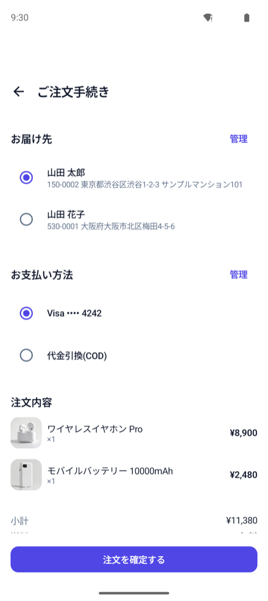

1. **お届け先**：登録済みの住所から1つを選びます(丸いラジオボタンをタップ)。住所がない場合は「住所を追加」から登録できます。右上の「管理」から住所の追加・編集も可能です。
2. **お支払い方法**：登録済みの支払い方法から1つを選びます。ない場合は追加できます。右上の「管理」から編集も可能です。
3. **注文内容**：カートに入れた商品と数量の一覧。
4. **金額**：小計・送料・合計。

**お届け先とお支払い方法の両方を選択する**と、画面下の **「注文を確定する」ボタン** が押せるようになります。タップすると注文が確定します。

> 注文を確定すると、その内容は**注文履歴**に追加され、**カートは空**になります。

---

### 注文完了画面

注文が確定すると、確認画面が表示されます。

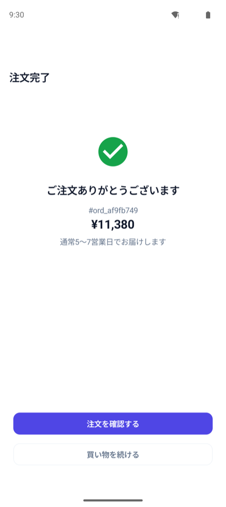

- ✅ 「ご注文ありがとうございます」
- 注文番号（例：`#ord_03fd6276`）と合計金額
- お届け目安（通常5〜7営業日）
- **「注文を確認する」**：この注文の詳細を開きます。
- **「買い物を続ける」**：ホームに戻ります。

---

## 7. 注文履歴

**アカウント → 注文履歴** から開きます。過去の注文が新しい順に一覧表示されます。

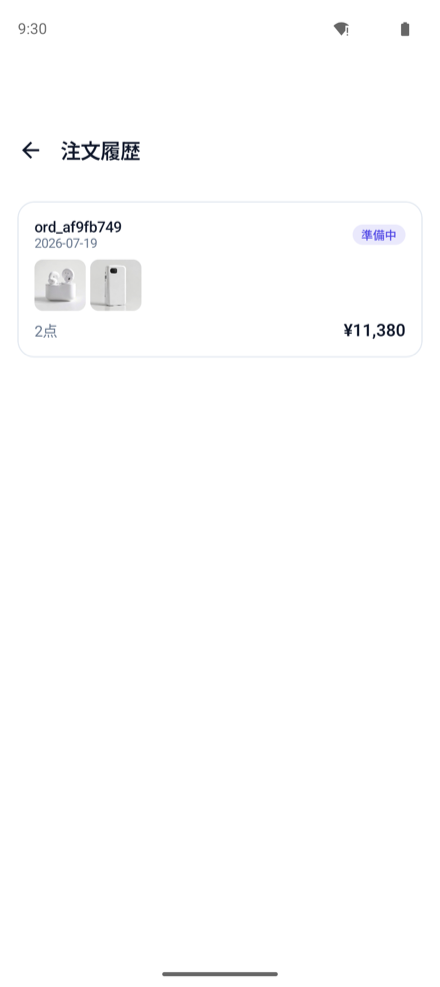

各注文には、**注文番号・注文日・商品・合計金額・ステータス**が表示されます。注文をタップすると詳細(商品明細・お届け先・お支払い方法・金額内訳)を確認できます。

### 注文ステータスの意味

| 表示 | 意味 |
|---|---|
| **準備中** | 注文を受け付け、発送準備をしている状態 |
| **発送済み** | 商品が発送された状態 |
| **配達済み** | お届けが完了した状態 |
| **キャンセル** | 注文がキャンセルされた状態 |

> 注文履歴はアカウントに紐づきます。新しいアカウントでは最初は空で、自分で確定した注文が「準備中」で追加されていきます。

---

## 8. お気に入り

下部タブの **お気に入り** から開きます。♡ で登録した商品が一覧表示されます。

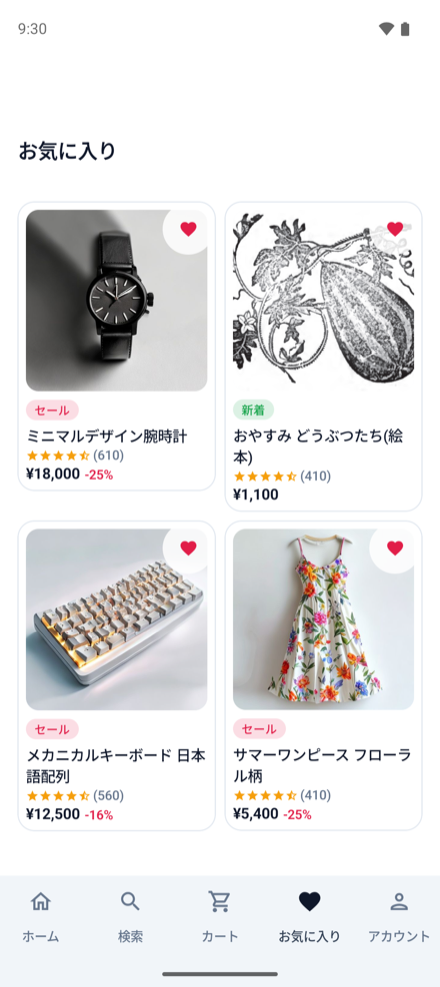

- 商品をタップすると詳細へ移動します。
- ♡ を再度タップすると、お気に入りから外れます。
- お気に入りの状態は、ホーム・検索・商品詳細など**すべての画面で共通**です。どこで登録・解除しても即座に反映されます。
- まだ何も登録していない場合は、その旨が表示されます。

---

## 9. アカウント

下部タブの **アカウント** から開きます。

### ログインしていないとき
- **「ログイン / 登録」ボタン**が表示されます。

### ログイン / 新規登録
初めて使うときは「ログイン / 登録」→「アカウントを作成」で、**お名前・メールアドレス・パスワード**を登録します。次回以降は、登録した**メールアドレスとパスワード**を入力して「ログイン」します。

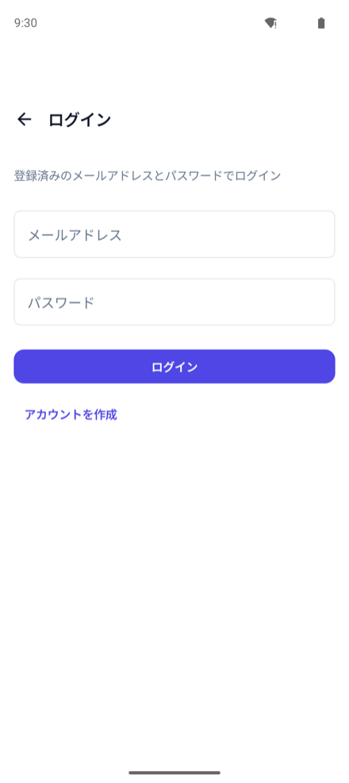

> アカウントは実際にサーバーへ登録されます。**同じメールアドレスでは二重に登録できません**。ログイン時にパスワードが違うと失敗します（デモ版のため、メール確認などの手続きはありません）。ログインすると、カート・お気に入り・注文・住所・支払い方法がそのアカウントに保存されます。

### ログインしているとき
画面上部にユーザー名とメールアドレスが表示され、以下のメニューが並びます。

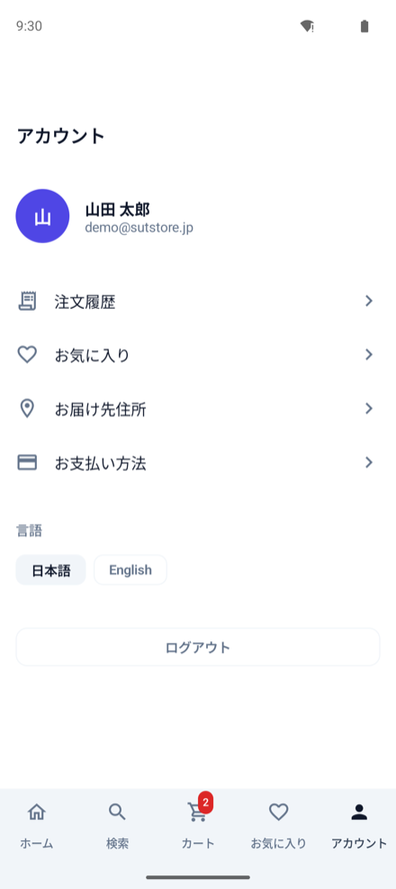

- **注文履歴** … [7. 注文履歴](#7-注文履歴)
- **お気に入り** … [8. お気に入り](#8-お気に入り)
- **お届け先住所** … [10. お届け先住所の管理](#10-お届け先住所の管理)
- **お支払い方法** … [11. お支払い方法の管理](#11-お支払い方法の管理)
- **言語** … [12. 表示言語の切り替え](#12-表示言語の切り替え日本語--english)
- **ログアウト** … アカウントからサインアウトします。

---

## 10. お届け先住所の管理

**アカウント → お届け先住所**、またはチェックアウトの「管理」から開きます。

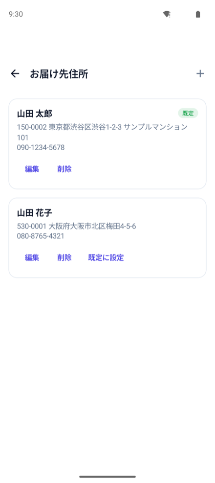

- **一覧**：登録済みの住所が表示されます。「デフォルト(既定)」の住所には印が付きます。
- **追加**：新しい住所を登録します。氏名・郵便番号・都道府県・市区町村・番地・建物名・電話番号などを入力します。
- **編集**：既存の住所を選んで内容を修正します。
- **削除**：不要な住所を削除します。
- **デフォルトに設定**：よく使う住所を既定にしておくと、チェックアウト時に最初から選択されます。

---

## 11. お支払い方法の管理

**アカウント → お支払い方法**、またはチェックアウトの「管理」から開きます。

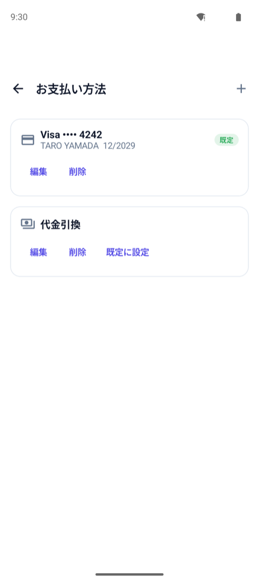

- **一覧**：登録済みの支払い方法が表示されます。
- **追加**：支払い方法を登録します。
  - **クレジットカード**：カードブランド・カード番号(下4桁で表示)・名義・有効期限を入力します。
  - **代金引換**
- **編集・削除・デフォルト設定**：住所と同様に行えます。

> デモ版のため、実際の決済は行われません。入力したお支払い方法はアカウントに保存されますが（カードは下4桁のみ表示）、課金は一切発生しません。

---

## 12. 表示言語の切り替え（日本語 / English）

**アカウント → 言語** で、**「日本語」／「English」** を選べます(切り替えボタンはアカウント画面の下部にあります。[9. アカウント](#9-アカウント)の画面例を参照)。

- 選んだ瞬間に、**アプリ全体の表示が即座に切り替わります**（画面を開き直す必要はありません）。
- 商品名・説明・レビューなども、対応する言語で表示されます。

---

## 13. よくある質問・用語集

### タグの意味

商品カードや商品詳細に表示されるタグです。

| タグ | 意味 |
|---|---|
| **ベストセラー** | よく売れている人気商品 |
| **Prime** | (デモ上の)優先配送対象を示す表示 |
| **セール** | 値引き中の商品 |
| **新着** | 新しく追加された商品 |
| **残りわずか** | 在庫が少なくなっている商品 |

### よくある質問

**Q. 注文したら本当に商品が届きますか？**
A. いいえ。現在はデモ版のため、実際の発送・課金は行われません。

**Q. カートに入れた商品が消えました。**
A. ログインしていると、カートはアカウントに保存されます。ログインしていない状態のカートは一時的なもので、ログイン時にアカウントの内容へ切り替わります。ログインしてご利用ください。

**Q. 商品や画像が表示されません。**
A. 商品情報・画像は SUT Store サーバーから取得します。サーバーへの接続をご確認ください（サーバーが停止していると表示されません）。

**Q. ログインできません。**
A. 登録済みのメールアドレスとパスワードが正しいかご確認ください。初めての場合は「アカウントを作成」から登録してください。同じメールアドレスは二重登録できません。

**Q. アプリを開き直したらログアウトされていました。**
A. 通常、一度ログインすればアプリを終了・再起動してもログイン状態は保たれます。ただし時間が経つとセッションが切れ、「セッションが切れました。再度ログインしてください」と表示されてログアウトされることがあります。その場合は再度ログインしてください。

**Q. 「読み込みに失敗しました」と出ます。**
A. 通信状況が悪い、またはサーバーに一時的に接続できない可能性があります。「再試行」ボタンでやり直してください。改善しない場合はしばらく時間をおいてお試しください。

**Q. 画面が急に暗い配色になりました。**
A. アプリは端末の設定（ダークモード）に自動で追従します。アプリ内に独自の切り替え設定はありません。端末側の外観モードをご確認ください。

**Q. 送料を無料にするには？**
A. 商品の小計が 3,000円以上になると送料が無料になります(未満の場合は送料500円)。カート画面に「あと◯◯円で送料無料」の案内が出ます。

---

*本マニュアルはデモ版（サーバー連携版）の内容に基づいています。実サーバーとの連携・実認証・データ保存に対応済みで、実決済・実配送は未対応です。今後さらに機能が追加された場合、内容は変更されることがあります。*
